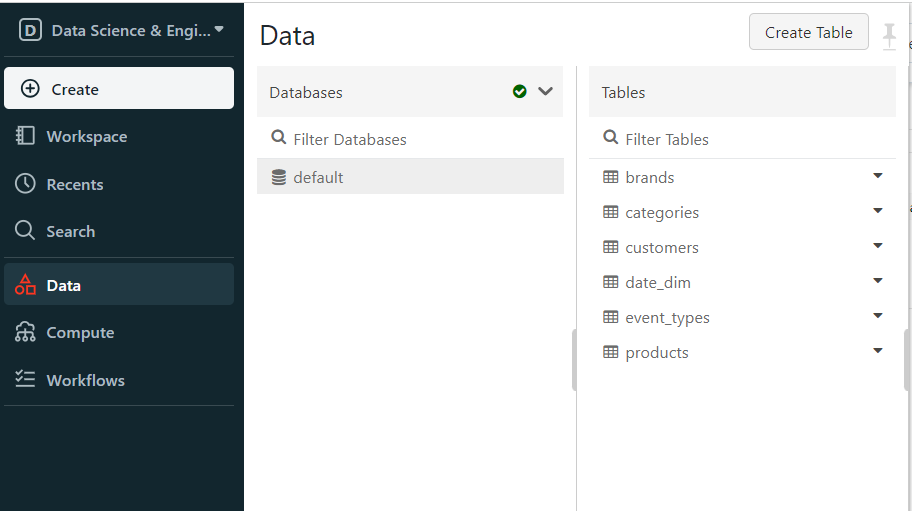

# Project Title
End-to-End Data Pipeline: Ingest, Process, and Visualize Data with Apache NiFi, AWS S3 Bucket, Pyspark, Databricks, and Power BI"

## Description

In this data pipeline, I used Apache NiFi to ingest and load data into an Amazon S3 bucket.Next, PySpark is employed to process, transform, and analyze the data efficiently.
Databricks facilitates a smooth transition from PySpark to Power BI, enabling easy and interactive data visualization for informed decision-making.
This end-to-end data pipeline simplifies the journey from raw data to actionable insights.

## Table of Contents

- [Prerequisites](#prerequisites)
- [Installation](#installation)
- [Project Stages](#project-stages)


## Prerequisites

System requirements:
Windows 10 OS
At least 4 GB RAM
Free space of at least 20 GB
Ensure that you have the following installed:
- Java JDK  8 or 11+
- Python 3.8.8 ,Anaconda 
- Apache NIFI Tool
- Create an AWS account
- Spark 3.5.0
- Hadoop winutils 3.3.0
- Spark Jar Packages - Hadoop-aws , Hadoop-common , java-bundle ,guava 
- Databricks account 
- Power BI Desktop

## Installation

1. Java Installation steps 
	1. Go to the official Java site
	2. Download jdk-8u201-windows-x64.exe file
	3. Double Click on the Downloaded .exe file
	4. Click Next until you finished the installation
	5. Go to Control Panel -> System and Security -> System -> Advanced Settings -> Environment Variables 
	6. To add JAVA_HOME, click on the New button under User variable for <USER>  enter your path
	7. Add %JAVA_HOME%\bin in path variable 
	8. Test Java Installation in cmd by using the following command:
           ```bash
            java -version
           ```
			   
2. Nifi installation and download steps 
	1. Go to the Apache NIFI site https://nifi.apache.org/download.html
	2. choose the binary file zip 
    3. Once the zip file has been downloaded, just extract it. 
	4. to run NIFI , navigate to bin folder and double-click on the run-nifi.bat file.
	5. Open your NiFi UI by using NIFI url https://localhost:8443/nifi or https://127.0.0.1:8443/nifi 
	6. You should be prompted with the login page 
	7. Open the logs/nifi-app.log, look for “Generated”, and you should see both the username and password.
	
3. Spark Installation 
	1. Go to Apache Spark's official download page and choose the latest release. For the package type, choose ‘Pre-built for Apache Hadoop’.
	2. Once the download is completed, unzip the file
	3. Go to the conf folder and open the log file called log4j.properties. template. 
	   Change INFO to WARN(It can be an ERROR to reduce the log) and remove .template extension so that Spark can read the file (optional) . 
	4. Add %SPARK_HOME%\bin to the path variable like  JAVA_HOME
	5. Spark needs a piece of Hadoop to run. For Hadoop 3.3.0, you need to install winutils.exe.
	6. search for winutils.exe For Hadoop 3.3.0
	7. Create a folder called winutils in C drive and create a folder called bin inside. Then, move the downloaded winutils file to the bin folder.
	8. Add  %HADOOP_HOME%\bin to the path variable.
	9. Test spark installation by typing in cmd the following command:
           ```bash
            spark-shell
           ```
		 
4. If you do not have Anaconda or Python, please follow the instructions in the reference anaconda installation guidance.

5. Download spark jar packages from mvn repository site https://mvnrepository.com/
	1. Search for hadoop-aws 
	2. Please make sure that you choose the same version as hadoop winutils.exe 
	3. While selecting your suitable version , you will know the corresponding java-bundle jar version  and the hadoop-common jar. 
	4. Once you go to hadoop-common , you will know the corresponding gauva jar version. 
	4. Download all jar files that were mentioned above then copy-paste in spark Jars folder. 
	
6. Download Power BI Desktop.

## Project Stages
  
## Stage 1 : Data Ingestion 
Data Pipeline Flow and Configuration
### Why Apache NIFI ?
Apache NIFI is used as open-source software for automating and managing the data flow between systems. It provides a web based UI to create, monitor, and control data flows.
It is widely used to collect real-time streaming data in Big data environments to capture, process, and analyze the data.
In this data pipeline, I fetched the data from the local filesystem 'downloaded from Kaggle', split each file to multiple files and push them to s3 bucket.
Step 1: Create a Process Group 
Create a process group to understand and maintain data flows easier. Moreover, I could create a template for this process group ,
  download that template to use at any other server.
	
	
Step 2: Configure Parameter Context 
Create parameters allow us to bind a set of configurations to any connector pipe in runtime
	
	
Click on ADD Processor Icon to drag the desired processor
	

Step 3: Configure List Files Processor 
List all file names in your specified directory.
	
	
Step 4: Configure Fetch File Processor
Fetch all data in each file. The benefit of using Fetch File Processor instead of Get File Processors,
that Fetch file does not delete files from your directory unlike Get File Processor.
	
Step 5: Configure Split Record Processor 
Split large Flow File to multiple flowfiles to facilitate storing the data in s3 bucket.
	
	
Step 6: Configure Update Attribute Processor
This processor is used for creating a unique name for each flowfile by using UUID and NIFI Expression Language as shown in the below image
	
	
Step 7: configure Put S3 Object Processor
Configure the following properties:
	1. Access Key ID
	2. Secret Access Key 
	3. Bucket 
	4. Region
To configure those properties, you need to go to the Amazon Site , create an account then create a new IAM user-to have permission to write to S3.
	

## Stage 2 : Data Processing and Transformation

### About Data set
AWS S3 Bucket contain files which describe the behavior of data for 2 months October and November from a large multi-category online store.
Each row in the file represents an event. All events are related to products and users.
How to read it :
User user_id during session user_session added to shopping cart (property event_type is equal cart)
product product_id of brand brand of category category_code (category_code) with price price at event_time.
to know more details for data set please see the following link
https://www.kaggle.com/datasets/mkechinov/ecommerce-behavior-data-from-multi-category-store/data
	
### Spark and Databricks
Ingest and transform data from an AWS S3 bucket using PySpark DataFrames. 
The spark notebook covers various stages,including data exploration, handling null values,
data preparation, building a data model, and creating tables for analysis and visualization.

**Prerequisites**
Before running the notebook, ensure you have the following:
Access to Databricks environment
Create Compute Resource Cluster
Appropriate AWS S3 credentials (access key and secret key)

The notebook is organized into sections, each focusing on a specific aspect of data processing and modeling:

**Import Libraries**
Import all necessary libraries and dependencies.
**Data Exploration and Transformation**
Explore data types, null values, and descriptive statistics.
Drop duplicate rows and handle null values in the dataset.
**Data Preparation**
Create new columns for category name, product name, and other relevant information.
Utilize window functions to generate new IDs for products, categories, events, and brands.
Extract date information from timestamps.
**Handling Null Values**
Fill null values for 'brand' and 'category_code' columns with appropriate default values.
**Build a Data Model**
Create tables for customers, products, categories, brands, event types, and date dimensions.
Build a transactions fact table with the necessary details.
Use 
```bash
!pip install faker
```
to install the faker library to create fake names,emails and address.
**Save Dimensions and Fact Tables in Databricks**


## Stage 3 : Data Visualization 

Visualize data and create interactive dashboards in Power BI by establishing a connection between Power BI and Databricks via JDBC of Spark Cluster.

**Prerequisites**
Access to Databricks environment with a running Spark cluster.
Power BI Desktop installed on your local machine.
JDBC URL for connecting Power BI to Databricks.
Dataset and tables created in Databricks.

**Connection Setup**
Generate JDBC URL:
In Databricks, obtain the JDBC URL required for Power BI to connect to the Spark cluster.

## **Set Up Power BI Connection**
Open Power BI Desktop.
Navigate to "Home" > "Get Data" > "More..." > "search for spark" 
Paste the Databricks JDBC URL and provide necessary authentication details.

## **Creating Dashboards**
### Dashboard 1: **E-commerce Customer Behaviour**
Visualizations:
Create visualizations such as Ribbon chart,  pie chart , Funnel chart, line and clusterd column chart.
Interactivity:
Apply date filter for interactive exploration.

### Dashboard 2: **E-commerce Customer Spent Time Analysis**
Visualizations:
Build visuals highlighting customer session duration 'spending time', and popular product brands.
Interactivity:
Drop down filters for products , brands , categories and event types for interactive exploration.
Include bookmarks or buttons for easy navigation.
Navigation and Publishing

### Bookmarks and Buttons
Use Power BI's bookmark feature to capture the state of each dashboard to be able to reset.
Create buttons for navigation, allowing users to switch between the  **E-commerce Customer Behaviour** and **E-commerce Customer Spent Time Analysis** seamlessly.

### **Publish to Power BI Service**
Save the Power BI file and publish it to the Power BI Service.
You could view it through the following link:
https://app.powerbi.com/view?r=eyJrIjoiNzNkNTQ4MmItZmJiNS00ZThhLTgwOTQtN2ZkZTg0M2M5MzA2IiwidCI6ImRmMDExNTMwLWM4MDYtNDVjYS1iMjc4LTcwZjY2Njc0NDRkNiJ9


